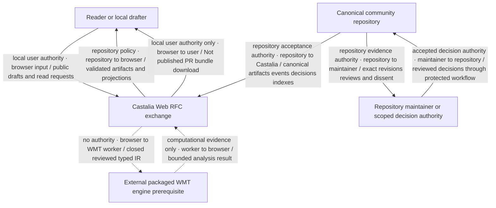
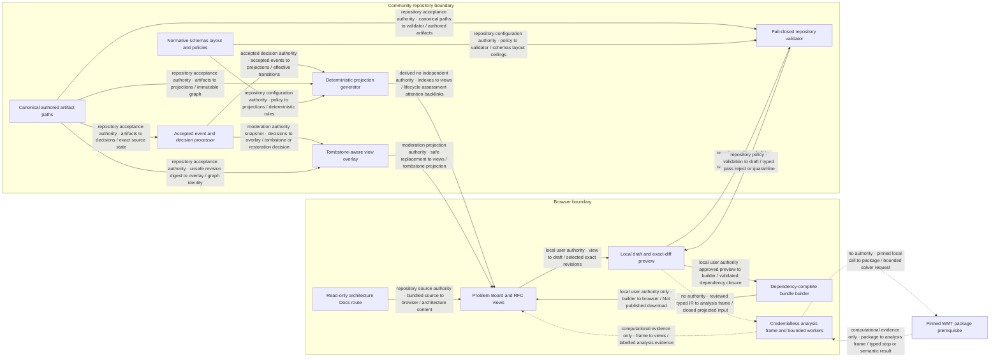
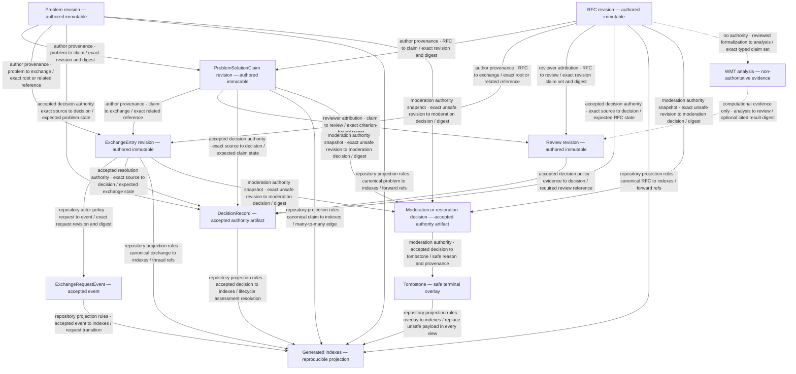
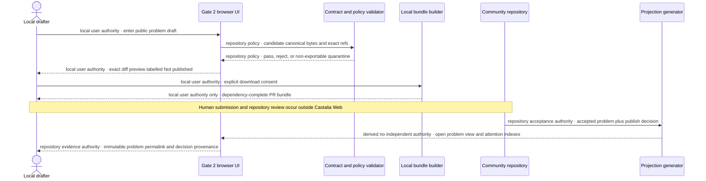
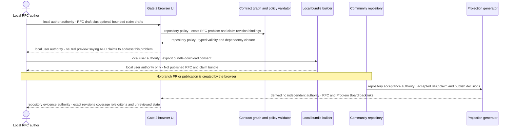
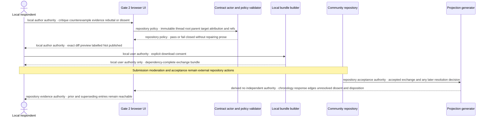
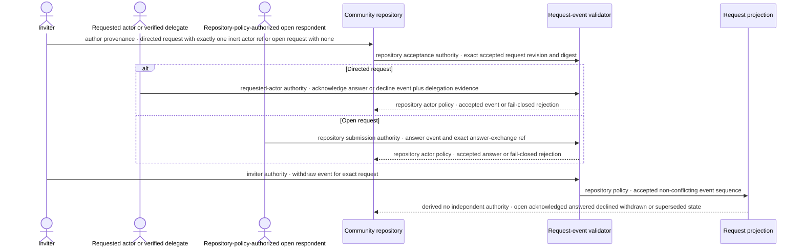
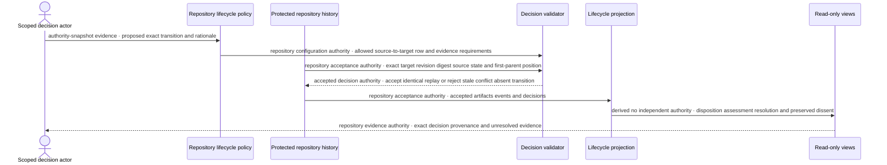
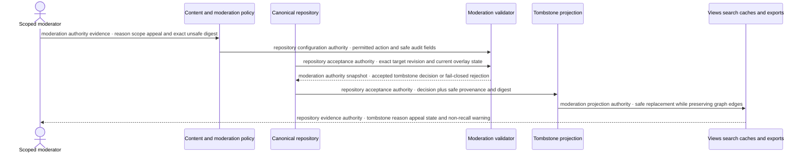

# RFC exchange architecture and authority map

Status: implementation architecture for the approved Issue #16 design; this document describes planned components and contracts, not deployed product behavior.

This is the single entry point for the paired Problem Board and community RFC exchange architecture. The two product views read one repository-backed exchange graph. A solution claim is a first-class many-to-many artifact: it records that one exact RFC revision **claims to address** one exact problem revision, but it does not establish truth, support, acceptance, or that the problem is solved.

## Scope and system context

The architecture covers a read-only browser view and a future Gate 2 local-export workflow. The current site route renders only this design documentation. Future Gate 2 product routes may draft, validate, preview, and download dependency-complete pull-request bundles, persistently labelled **Not published**. They must not publish, create branches or pull requests, collect credentials, send notifications, call remote models, mutate Matrix or repository state, or execute governance.

The community repository is the canonical authority boundary for accepted public artifacts, events, decisions, and generated projections. The protected branch's linear first-parent history determines acceptance order. Git supplies revision history; the repository layout does not duplicate historical revisions in a second directory tree.

The external `bananawalnut/world-model-trajectories` fork is a prerequisite package boundary, not a component currently available in Castalia Web. It must first produce a signed, versioned, reproducible, worker-safe browser-engine release that excludes UI, provider calls, API-key storage, implicit persistence, and fail-open solver behavior. Even after that gate, WMT output is evidence about a supplied formalization only; it has no repository, review, lifecycle, moderation, truth, or governance authority.

## Component and data ownership

| Component / package | Owns | Reads | Must not own or imply | Downstream node |
| --- | --- | --- | --- | --- |
| `apps/web` Problem Board and RFC views | Accessible presentation, intent-specific local drafting UX, exact-revision navigation, neutral comparison, **Not published** labelling | Generated indexes and validated public canonical artifacts | Canonical artifacts, accepted state, ranking, assignment, notification, publication, decisions | A6, A7 |
| `apps/web` architecture Docs route | Read-only rendering of this architecture package and text alternatives | Shared typed architecture content | Live data, credentials, mutation controls, publication, WMT execution | A1 (this issue) |
| `packages/contracts` | JSON Schemas, generated TypeScript, closed enums, canonical reference and envelope shapes | Normative repository profile | Repository acceptance, actor standing, lifecycle choices | A2 |
| Repository validator | Path/schema/ID/reference checks, byte/count/depth ceilings, canonicalization, digest verification, content-policy classification | Authored artifacts plus normative layout and policies | Repairing invalid input, authority inference, remote fetching | A3 |
| Bundle builder | Dependency closure, fixed safe filenames, exact-diff preview, local download | Validated in-memory drafts and required generated deltas | Credentials, network submission, branches, pull requests, publication | A4 |
| Canonical community repository | One stored copy of each authored artifact, accepted event/decision, policy, actor evidence, and tombstone | Human-submitted pull requests and authorized decisions | Runtime secrets, Matrix state, duplicated backlinks, WMT verdicts | A3, A8 |
| Projection generator | Reproducible lifecycle/assessment/attention/thread/backlink indexes | Accepted canonical artifacts, events, decisions, tombstones | Authored meaning, irreversible source mutation, inferred authority | A5 |
| Repository decision processor | Exact source-to-target transition validation and accepted authority snapshots | Accepted events/decisions and lifecycle policy | Automatic truth, solver authority, author-controlled status | A8 |
| Moderation/redaction processor | Terminal tombstone overlay and safe audit projection | Authorized moderation/restoration decisions | Silent deletion, recall of forks, lifecycle rewriting | A9 |
| Credentialless analysis origin and bounded workers (future) | Deterministic local projection to a pinned WMT package, cancellation, typed stop results | Public reviewed claim sets supplied by the user | Application credentials, persistence, network access, publication, review or decision authority | A6 after external Gate 0 |
| External WMT package (prerequisite) | Typed reasoning over a confirmed formalization under explicit profiles and budgets | Closed projected input only | Natural-language interpretation, truth, consensus, ranking, publication, decisions | External Gate 0 |

### Canonical authored artifacts

The repository stores each multi-target artifact once at a schema-defined canonical path:

- `ProblemEntryV1` — immutable problem statement, scope, evidence/counterevidence, questions, and stable success/falsification criterion IDs;
- `RfcMetadataV1` plus Markdown source — immutable proposed mechanism, design, experiment, or intervention;
- `ProblemSolutionClaimV1` — exact problem/RFC revision binding, `full | partial` coverage, approach role, criterion coverage, evidence, assumptions, limitations, risks, and falsifiers;
- `ExchangeEntryV1` — append-only message with an immutable root subject, optional parent, attribution, request mode, and exact artifact references;
- `ExchangeRequestEventV1` — immutable acknowledge, answer, decline, or withdraw event bound to the exact request revision and authorized actor evidence;
- peer/formalization reviews, repository events, decision records, actor/delegation evidence, external-source envelopes, and tombstones.

Immutable authored revisions contain forward semantic references only. They never contain mutable status, backlink, review, exchange, decision, attention-counter, or generated-index arrays.

### Accepted authority artifacts

Only accepted `RepositoryEvent` and `DecisionRecord` artifacts may affect lifecycle or assessment state. Each binds the exact target revision and digest, expected source state, repository authority, authority snapshot, and idempotency key. Stale targets, source-state mismatch, conflicting same-commit transitions, duplicate IDs with different bytes, non-linear accepted history, and absent lifecycle transitions fail closed.

Request response authority is narrower: a directed request has exactly one inert recipient; only that actor or a request-scoped verified delegate may acknowledge, answer, or decline. The inviter or an authorized moderator may withdraw. An open request has no recipient and may only be answered by a repository-policy-authorized actor or verified delegate. Silence creates no assignment, obligation, endorsement, standing, or authority.

### Generated projections

Indexes are disposable, deterministic outputs regenerated from accepted canonical artifacts. They own:

- problem-to-RFC and RFC-to-problem backlinks;
- lifecycle disposition and decision-backed assessment;
- request and exchange state;
- review resolution and preserved dissent;
- moderation-aware search/view replacement;
- attention facets such as contested, unanswered, candidate solutions, unresolved counterexamples, and dormancy.

Attention never changes disposition or assessment. Closing never means solved. `solved_under_criteria` requires an exact authorized decision citing criteria, evidence, unresolved counterevidence, linked RFC revisions, and dissent.

## Canonical repository boundary

The normative repository profile is one repository per community/authority boundary:

```text
community-rfcs/
├── rfc-repository.json
├── repository-layout.json
├── schemas/
├── policies/
├── actors/
├── external-sources/
├── problems/
├── rfcs/
├── solution-claims/
├── exchanges/
├── events/
├── decisions/
├── tombstones/
├── indexes/
└── fixtures/
```

`repository-layout.json` owns path regexes, schema mapping, ID grammar and normalization, filenames, authored/generated path classes, no-symlink policy, reference limits, canonical bytes, digest domains, and index commands. Canonical JSON uses RFC 8785 JCS with the approved Unicode and safe-number restrictions. The `castalia.sha256-jcs.v1` profile uses the domain-separated SHA-256 preimage defined by the Issue #16 design. Unknown governed files, traversal, symlinks, duplicate or mismatched IDs, digest mismatch, forbidden cycles, stale indexes, non-reproducible projections, and replay with different bytes are rejected.

Local canonical references resolve under CI and bind repository authority, kind, globally scoped ID, exact revision/path/commit, and digest. External citations are visibly untrusted, never auto-fetched, and cannot affect lifecycle, standing, delegation, or solution status. Cross-repository import requires an authorized import decision, immutable source evidence, local revalidation, and a new local canonical artifact.

## Gate 2 local-export-only boundary

The future minimum product slice is browser-local and public-only until explicit download:

1. draft an artifact with exact immutable targets;
2. validate schema, policy, graph, attribution, canonicalization, and limits;
3. preview the exact dependency-complete diff;
4. download a fixed-name pull-request bundle after explicit consent.

Every step remains **Not published**. Unsupported mutation endpoints are absent or return `405 Unavailable`. The browser accepts no repository, Matrix, wallet, model-provider, reviewer, or application credentials. Recipient references remain inert and emit no active mention. No remote content is fetched. Prohibited content is rejected; ambiguous content enters non-exportable quarantine. A later authenticated mutation/notification design requires its own accepted issue.

## External analysis boundary

If external Gate 0 is completed, Castalia may project a validated, reviewed typed claim envelope into the exact WMT input grammar. The credentialless analysis origin receives no ambient app authority, has no network or persistence, and runs pinned artifacts in bounded workers. Cancellation or failure terminates the complete worker tree and discards partial output. `unknown`, malformed output, timeout, cancellation, enumeration cap, and resource exhaustion remain distinct fail-closed results.

An analysis binds exact RFC, claim-set, projected-input, engine, solver, logic-profile, and budget digests. Browser output remains unverified derived evidence until a locked job independently reproduces the deterministic semantic bytes from reviewed source and signed release provenance. Neither form can accept/reject an RFC, assess a solution claim, mark a problem solved, identify a social position, or constitute peer review.

## Explicit non-claims

This architecture and its read-only Docs route do not implement or prove:

- product Problem Board or RFC routes, schemas, validators, repository layout, bundle export, generated projections, decisions, moderation, deployment, or production behavior;
- repository mutation, publication, branches, pull requests, credentials, identity verification, notifications, assignment, or governance execution;
- truth, factual accuracy, natural-language formalization faithfulness, community consensus, reviewer standing, RFC acceptance, solution support, problem resolution, ranking, recommendation, funding, or treasury authority;
- current availability or execution of an embeddable WMT package, remote model calls, Matrix access, private-content processing, or persistence; or
- recall of already-forked copies after moderation or redaction.

## UML/C4 diagram conventions

Every edge label has the form **authority · direction / data**. `Repository policy` means deterministic validation under accepted repository configuration; `accepted decision authority` means the exact authority snapshot carried by a valid decision. `local user action` is not publication authority. Dashed WMT edges carry non-authoritative evidence only.

## C4 system context



**Text alternative.** A reader supplies local public drafts or read requests to Castalia. The canonical repository supplies accepted artifacts and projections under repository acceptance authority. Castalia can return validated views or a local **Not published** download, never publication. A scoped maintainer contributes decisions only through the protected repository workflow. A future credentialless worker may send closed typed IR to a separately packaged WMT engine and receive non-authoritative computational evidence.

## C4 containers and components



**Text alternative.** The Docs route is bundled read-only source. Future product views can pass exact revisions into local drafting; repository policy validates candidates before exact-diff preview and local bundle download. Canonical artifacts, normative policy, accepted decisions, deterministic projections, and moderation overlays remain repository components with separate ownership. The optional analysis frame receives only reviewed typed IR and returns labelled evidence without authority.

## Artifact graph and ownership



**Text alternative.** Problems and RFCs bind into one canonical solution claim. Problems, RFCs, and claims can be referenced by one stored exchange. Accepted request events change only request projections. Reviews may provide evidence to a decision, but only a valid decision changes lifecycle or assessment. Every canonical artifact contributes to reproducible indexes. Moderation decisions create tombstones that replace unsafe payloads in all projections while preserving graph identity. WMT analysis can be cited by a review but cannot become a review or decision.

## Problem publication and view sequence



**Text alternative.** Local drafting is validated and can end only in a user-authorized **Not published** bundle download. Human submission and repository review happen outside Castalia Web. Only after repository acceptance of the problem and publish decision can projection generation expose an open problem view.

## RFC and solution-claim sequence



**Text alternative.** An RFC author can locally draft an RFC and optional solution claims, but validation preserves exact problem/RFC revision bindings and never defaults coverage to full. Download does not publish. Accepted canonical artifacts and decisions later generate backlinks visible from both Problem Board and RFC views without storing a second claim.

## Exchange and challenge sequence



**Text alternative.** A respondent locally authors an append-only exchange against exact targets. Validation checks thread and attribution invariants. Browser output is only a local bundle. Repository acceptance later allows deterministic chronology, response, correction, resolution, and dissent views; no correction hides prior prose.

## Request lifecycle sequence



**Text alternative.** A directed request binds exactly one inert recipient, while an open request binds none. The requested actor or verified delegate may acknowledge, answer, or decline a directed request. An authorized repository actor may answer an open request but cannot acknowledge or decline it. The inviter or moderator may withdraw. Stale, unauthorized, malformed, duplicated-different, or conflicting terminal events fail closed. Silence has no effect.

## Decision lifecycle sequence



**Text alternative.** A scoped actor proposes a transition, but repository policy and exact accepted history determine whether the decision is valid. The validator rejects stale targets, source mismatch, conflicts, and transitions absent from the exhaustive matrix. Projections display the accepted result and provenance. Authors, activity counts, and WMT output never set state.

## Moderation and tombstone overlay



**Text alternative.** A scoped moderator supplies an exact digest, reason, scope, appeal state, and authority evidence. Accepted policy creates a safe tombstone projection. Every view, search result, cache, and later export uses the replacement while graph edges and safe provenance remain. The overlay cannot be reopened through lifecycle state; restoration requires a new authorized decision and clean artifact revision. Already-forked copies cannot be recalled.

## Diagram and decision index

The diagrams above are version-controlled Mermaid source with adjacent text alternatives. The ADR and verification map below binds their contracts to owning packages and downstream nodes.

## Architecture decision and verification map

| Decision | Locked contract | Owning implementation surface | Verification gate | Downstream node |
| --- | --- | --- | --- | --- |
| One exchange graph, two primary views | Problem Board and RFC browsing project the same canonical artifact graph. | `packages/contracts`, repository validator, `apps/web` | schema round trips, graph projection fixtures, route/browser tests | A2–A7 |
| One canonical solution assertion | `ProblemSolutionClaimV1` is the only artifact that links exact problem and RFC revisions; exchanges only reference it. | `packages/contracts`, repository validator | duplicate-representation rejection and bidirectional discovery fixtures | A2–A5 |
| Immutable authored revisions | Authored artifacts contain forward semantic references, not mutable state or generated backlinks. | schemas and canonical repository paths | unknown-field and mutable-status negative fixtures | A2, A3 |
| Decision-derived lifecycle | Only accepted exact-target events and decisions can change disposition or assessment. | decision processor and projection generator | exhaustive source-to-target transition fixtures and stale/conflict rejection | A3, A5, A8 |
| Request authority is mode-specific | Directed requests bind one inert recipient; open requests bind none; answer authority follows the accepted policy for that mode. | request-event schema, actor/delegation verifier, projections | authorized and unauthorized directed/open response fixtures | A2, A3, A4 |
| Tombstone is an overlay | Moderation hides unsafe payloads through a terminal overlay without rewriting lifecycle disposition or graph identity. | moderation processor and generated views | tombstone, appeal, restoration, cache, search, and export fixtures | A3, A5, A9 |
| Canonical bytes and identity | RFC 8785 JCS, approved text normalization, and `castalia.sha256-jcs.v1` bind exact bytes under domain separation. | `packages/contracts` and repository validator | published digest vector, one-byte mutation, Unicode, number, and self-digest tests | A2, A3 |
| Local export is not publication | Gate 2 may draft, validate, preview, and download only; it has no repository credentials or mutation endpoint. | `apps/web` and bundle builder | no-network/no-persistence browser tests, exact-diff tests, `405 Unavailable` mutation checks | A4, A7 |
| WMT is optional evidence | Only a pinned reproducible package may run in credentialless bounded workers; output is about confirmed formalization consistency, not truth. | analysis adapter and isolated worker origin | provenance, limit, cancellation, malformed-output, no-network, and reproducibility tests | A6 after external Gate 0 |
| Dissent remains reachable | Supersession and decisions never erase prior revisions, unresolved counterevidence, or preserved dissent. | canonical paths, indexes, routes | immutable permalink and historical dissent browser/graph tests | A3, A5 |

### Failure semantics

Validation fails closed before rendering, projection, or export when governed input has an unknown schema field, invalid or stale revision reference, digest mismatch, path violation, unsupported request mode, unauthorized actor/delegate, conflicting transition, forbidden cycle, non-linear accepted history, unsafe content, or resource-limit breach. A failure never falls back to latest aliases, repairs authored prose, downgrades authority, publishes a partial bundle, or emits a partial WMT result.

### Documentation and claim gates

- `scripts/verify-docs.sh` requires this architecture source, its diagram families, the decision map, the read-only route inventory, and the explicit non-claims.
- `scripts/check-routes-and-claims.mjs` must continue to reject routes or primary actions whose copy implies capabilities absent from the fixture shell.
- A2/A3 contract work must preserve closed enums, exact revision identity, canonicalization, and hostile fixtures before A6/A7 product routes can consume repository data.
- A6/A7 UI work may promote only claims proven by its own tests; fixture and static Docs routes remain visibly non-live.
- A8/A9 authority and moderation work cannot infer standing from Git attribution, agent self-description, invitation counts, endorsements, WMT output, or activity.

## Implementation order

1. A1 and A2 define architecture and UX in parallel.
2. A2 contracts and A8 authority policy can proceed after this ownership map stabilizes.
3. A3 repository validation follows canonical contracts.
4. A6 browsing and A7 local export depend on approved UX, contracts, and projections.
5. A6 WMT integration also waits for an immutable external Gate 0 package.
6. A9 performs integrated exact-head review and preview-deployment verification without authorizing production.
